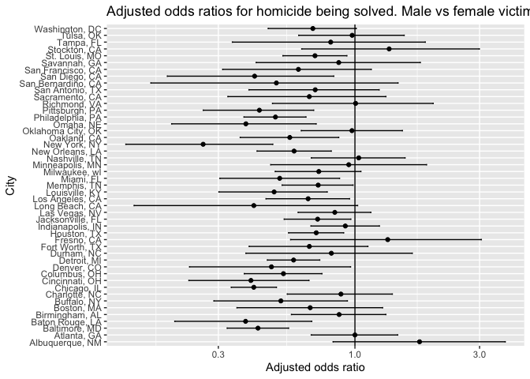
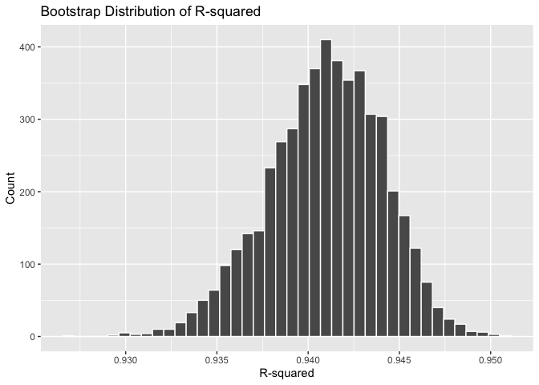
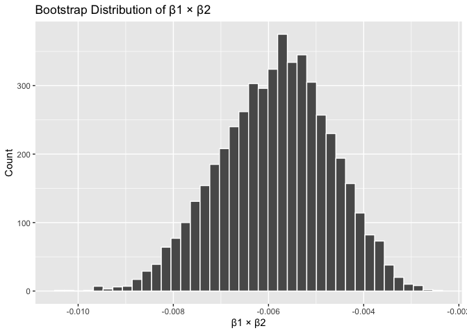

p8105_hw6_elk2149
================
Evan Kennedy
2025-11-26

***Problem 1***

``` r
url = "https://raw.githubusercontent.com/washingtonpost/data-homicides/refs/heads/master/homicide-data.csv"
df_homicide = readr::read_csv(url) |> 
  clean_names() |>
  mutate(
    # Make city_state variable
    city_state = str_c(city, state, sep = ", "),
    
    # Binary solved variable
    solved = disposition == "Closed by arrest",
    
    # Make sure age is numeric
    victim_age = as.numeric(victim_age)
  ) |>
  # Drop specific cities
  filter(
    !city_state %in% c(
      "Dallas, TX",
      "Phoenix, AZ",
      "Kansas City, MO",
      "Tulsa, AL"
    ),
    # Keep only White / Black victims
    victim_race %in% c("White", "Black")
  )
```

    ## Rows: 52179 Columns: 12
    ## ── Column specification ────────────────────────────────────────────────────────
    ## Delimiter: ","
    ## chr (9): uid, victim_last, victim_first, victim_race, victim_age, victim_sex...
    ## dbl (3): reported_date, lat, lon
    ## 
    ## ℹ Use `spec()` to retrieve the full column specification for this data.
    ## ℹ Specify the column types or set `show_col_types = FALSE` to quiet this message.

    ## Warning: There was 1 warning in `mutate()`.
    ## ℹ In argument: `victim_age = as.numeric(victim_age)`.
    ## Caused by warning:
    ## ! NAs introduced by coercion

``` r
#Log Regression for Baltimore

baltimore_df = df_homicide |>
  filter(city_state == "Baltimore, MD") |>
  mutate(
    # sex and race factors, Female as reference
    victim_sex  = relevel(factor(victim_sex), ref = "Female"),
    victim_race = factor(victim_race)
  )

#log regression
baltimore_logreg = glm(
  solved ~ victim_age + victim_sex + victim_race,
  data   = baltimore_df,
  family = binomial()
)

#get ORs and 95% CI
baltimore_logregtidy = baltimore_logreg |>
  tidy(conf.int = TRUE, conf.level = 0.95, exponentiate = TRUE)

#OR for male vs female
baltimore_male_or = baltimore_logregtidy |>
  filter(term == "victim_sexMale") |>
  select(term, estimate, conf.low, conf.high, p.value)

baltimore_male_or
```

    ## # A tibble: 1 × 5
    ##   term           estimate conf.low conf.high  p.value
    ##   <chr>             <dbl>    <dbl>     <dbl>    <dbl>
    ## 1 victim_sexMale    0.426    0.324     0.558 6.26e-10

The adjusted odds ratio for a homicide being solved comparing male to
female victims, holding age and race constant, was OR = 0.426 (95% CI
0.324, 0.558).

``` r
# now doing it for all cities

city_or_results =
  df_homicide |>
  # make sure they're factors
  mutate(
    victim_sex  = relevel(factor(victim_sex), ref = "Female"),
    victim_race = factor(victim_race)
  ) |>
 
  # nest by city
  group_by(city_state) |>
  nest() |>
  
  # fit glm for each
  mutate(
    fit = map(
      data,
      ~ glm(
          solved ~ victim_age + victim_sex + victim_race,
          data   = .x,
          family = binomial()
        )
    ),
    # tidy and get ORs and CI
    tidy = map(
      fit,
      ~ tidy(.x, conf.int = TRUE, conf.level = 0.95, exponentiate = TRUE)
    )
  ) |>
  
  select(city_state, tidy) |>
  unnest(tidy) |>
  
  # keep only the male vs female contrast
  filter(term == "victim_sexMale") |>
  arrange(desc(estimate))
```

    ## Warning: There were 43 warnings in `mutate()`.
    ## The first warning was:
    ## ℹ In argument: `tidy = map(fit, ~tidy(.x, conf.int = TRUE, conf.level = 0.95,
    ##   exponentiate = TRUE))`.
    ## ℹ In group 1: `city_state = "Albuquerque, NM"`.
    ## Caused by warning:
    ## ! glm.fit: fitted probabilities numerically 0 or 1 occurred
    ## ℹ Run `dplyr::last_dplyr_warnings()` to see the 42 remaining warnings.

``` r
city_or_results
```

    ## # A tibble: 47 × 8
    ## # Groups:   city_state [47]
    ##    city_state      term  estimate std.error statistic p.value conf.low conf.high
    ##    <chr>           <chr>    <dbl>     <dbl>     <dbl>   <dbl>    <dbl>     <dbl>
    ##  1 Albuquerque, NM vict…    1.77      0.385  1.48       0.139    0.825      3.76
    ##  2 Stockton, CA    vict…    1.35      0.397  0.760      0.447    0.626      2.99
    ##  3 Fresno, CA      vict…    1.34      0.425  0.680      0.496    0.567      3.05
    ##  4 Nashville, TN   vict…    1.03      0.210  0.160      0.873    0.681      1.56
    ##  5 Richmond, VA    vict…    1.01      0.359  0.0168     0.987    0.483      1.99
    ##  6 Atlanta, GA     vict…    1.00      0.194  0.000397   1.000    0.680      1.46
    ##  7 Tulsa, OK       vict…    0.976     0.237 -0.104      0.917    0.609      1.54
    ##  8 Oklahoma City,… vict…    0.974     0.227 -0.116      0.908    0.623      1.52
    ##  9 Minneapolis, MN vict…    0.947     0.348 -0.156      0.876    0.476      1.88
    ## 10 Indianapolis, … vict…    0.919     0.154 -0.551      0.582    0.678      1.24
    ## # ℹ 37 more rows

``` r
#plotting these findings
city_or_results |>
  # ordering cities
  mutate(city_state = fct_reorder(city_state, estimate)) |>
  ggplot(aes(x = estimate, y = city_state)) +
  geom_vline(xintercept = 1) +
  geom_point() +
  geom_errorbarh(aes(xmin = conf.low, xmax = conf.high), height = 0.2) +
  scale_x_log10() +
  labs(
    x = "Adjusted odds ratio",
    y = "City",
    title = "Adjusted odds ratios for homicide being solved. Male vs female victims, by city."
  )
```

<!-- -->

The majority of cities have adjusted odds ratios slightly below 1,
suggesting homicides involving male victims may be slightly less likely
to be solved than those involving female victims. Given that a large
proportion of these CIs do not cross 1.0, this odds is likely
statistically significant.

***Problem 2***

``` r
boot_results =
  tibble(strap = 1:5000) |>
  mutate(
    # bootstrap
    strap_sample = map(strap, ~ sample_frac(weather_df, replace = TRUE)),
    # model
    models = map(strap_sample, ~ lm(tmax ~ tmin + prcp, data = .x)),
    # r-squared
    r2 = map_dbl(models, ~ glance(.x)$r.squared),
    # b1 * b2
    beta_product = map_dbl(
      models,
      ~ {
        coefs = tidy(.x)$estimate
        coefs[2] * coefs[3]
      }
    )
  ) |>
  select(r2, beta_product)

# r dist
ggplot(boot_results, aes(x = r2)) +
  geom_histogram(bins = 40, color = "white") +
  labs(title = "Bootstrap Distribution of R-squared",
       x = "R-squared", y = "Count")
```

<!-- -->

``` r
# b1 * b2 dist
ggplot(boot_results, aes(x = beta_product)) +
  geom_histogram(bins = 40, color = "white") +
  labs(title = "Bootstrap Distribution of β1 × β2",
       x = "β1 × β2", y = "Count")
```

<!-- -->

``` r
r2_ci =
  boot_results$r2 |>
  quantile(c(0.025, 0.975))

beta_ci =
  boot_results$beta_product |>
  quantile(c(0.025, 0.975))

r2_ci
```

    ##      2.5%     97.5% 
    ## 0.9343767 0.9466277

``` r
beta_ci
```

    ##         2.5%        97.5% 
    ## -0.008206450 -0.003711344

***Problem 3***
